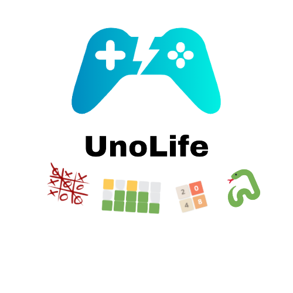

 

  

   
   

  

# UnoLife, the way of unordinary life

This is the perfect app for anyone looking to spice up their life! It has a bunch of apps and features
to help you make your everyday less ordinary by keeping you occupied with new and exiting games!

You can try the app by downloading one of the prebuilt releases or building it from scratch using rust.
It should work on all platforms, please don't hesitate to contact us and look at the faq if you have any issues or questions.

## The idea

The original idea was to make an app similar to Dekstop Goose where a goose is interuppting your everyday use.
Here is a video showcasing that application: https://www.youtube.com/watch?v=EQx6fyrZDWM

However due to complications with the UI library we were using and the lack of time we decided to settle on a more standard approach of a minigame collection.

## Features

- TicTacToe: Play the classic game of tictactoe against a friend or AI that we made!
- Wordle: Play the ever popular wordle game remastered using rust in our app!
- Snake: Play the classic snake game and try to get a highscore!
- 2048: Play 2058 while enjoying the nice looking graphics!
- 15 Puzzle: Play fifteen puzzle the classic way!
- Reddit meme: Get a random reddit meme from popular subreddits and view them right in the app!
- Highscores: The app supports highscores for every game, so you will always have something to look forward to beating when playing!
- Settings: You can customise the look and feel of the app by for example changing the theme!

## Contributions

We love your open source enthusiasm. Seeing a application grow a bigger community is possibly the best thing a developer can expect.
We don't accept pull requests for now as the codejam is still ongoing, but we will update the README once it ends and feel free to make a pull request then.